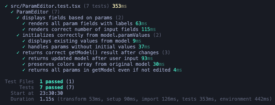

# ParamEditor test task

Parameter editor component in React and TypeScript.

## Quick Start

```bash
npm i && npm test && npm run dev
```



Tests verify component behavior, then dev server starts at http://localhost:5173

## Implementation Notes

### Why not "single-file" for all demo code?

1. App component in main.tsx causes HMR double-mount issues.
2. App component in ParamEditor.tsx mixes concerns – ParamEditor is the reusable solution, App is just a test harness.

The deliverable is `ParamEditor.tsx` – everything else is infrastructure.

### State initialization from props

Component initializes state once in constructor (uncontrolled pattern). Props changes after mount won't sync automatically. If needed in future, we can use key prop (e.g. productId) to force remount.
